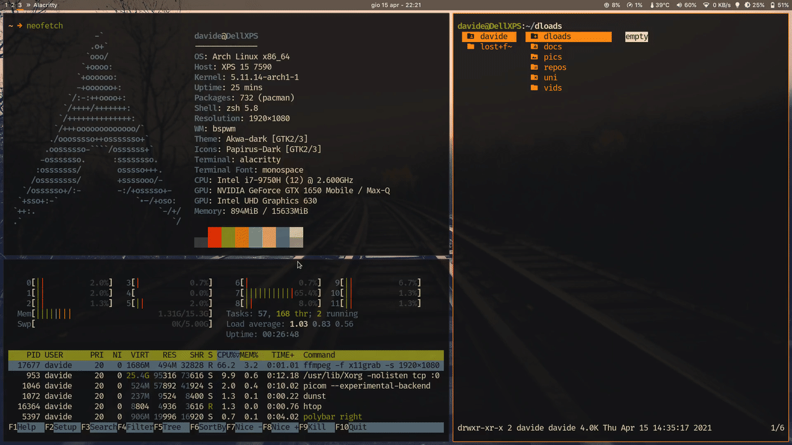

# slock - simple screen locker

simple screen locker utility for X.



Included in this build:

- [DPMS Patch](https://tools.suckless.org/slock/patches/dpms/)
- [PAM auth patch](https://tools.suckless.org/slock/patches/pam_auth/)
- [Message patch](https://tools.suckless.org/slock/patches/message/)
- Xft font support.

## Requirements

In order to build slock you need the Xlib header files.

## Installation

Edit config.mk to match your local setup (slock is installed into
the /usr/local namespace by default).

Afterwards enter the following command to build and install slock
(if necessary as root):

```sh
make clean install
```

## Running slock

Simply invoke the 'slock' command. To get out of it, enter your password.

## Blur effect

This fork leverages picom's new kawase blur method instead of taking a screenshot, blur it using ImageMagick without hardware acceleration and then set it as the lock screen wallpaper.
The end result is much higher performance and much lower latency.
